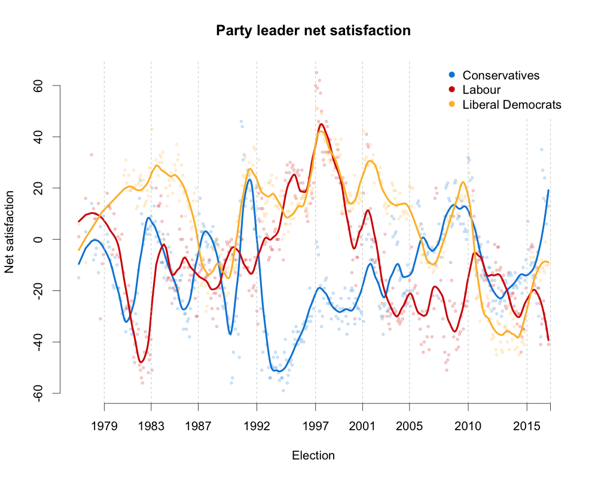
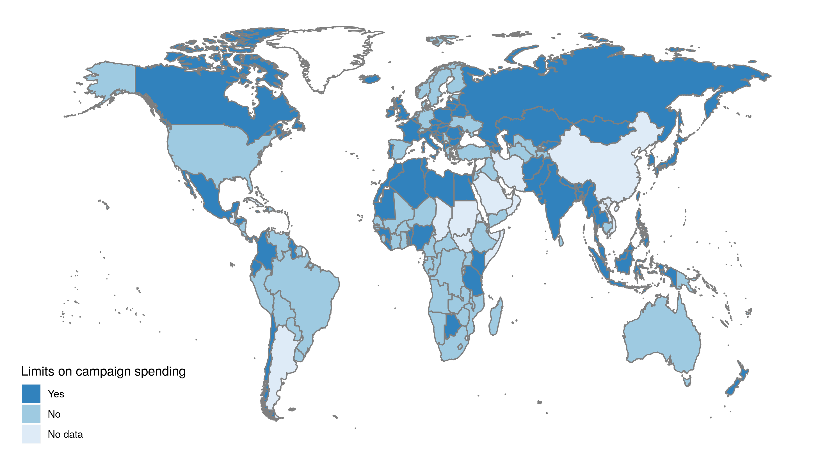

<style>
div.footnotes {
  position: absolute;
  bottom: 0;
  margin-bottom: 10px;
  width: 80%;
  font-size: 0.6em;
}
</style>

<script src="https://ajax.googleapis.com/ajax/libs/jquery/3.1.1/jquery.min.js"></script>

<script>
  $(document).ready(function() {
    $('slide:not(.backdrop):not(.title-slide)').append('<div class=\"footnotes\">');

    $('footnote').each(function(index) {
      var text  = $(this).html();
      var fnNum = (index+1).toString().sup();
      $(this).html(text + fnNum);

      var footnote   = fnNum + ': ' + $(this).attr('content') + '<br/>';
      var oldContent = $(this).parents('slide').children('div.footnotes').html();
      var newContent = oldContent + footnote;
      $(this).parents('slide').children('div.footnotes').html(newContent);
    });
  });
</script>

# R basics

## Materials

You can find the <footnote content="The original version of the slides was created by Jack Blumenau">materials</footnote> for today's course on my website. Either go to the Moodle page for MY591 and click on the links, or:

  - Assignment: [tom.paskhal.is/MY591/exercises.html](https://tom.paskhal.is/MY591/exercises.html)
  - Slides: [tom.paskhal.is/MY591/intro_to_r.html](https://tom.paskhal.is/MY591/intro_to_r.html)
  - Source Code: [github.com/tpaskhalis/MY591_Introduction_to_R](https://github.com/tpaskhalis/MY591_Introduction_to_R)

It is worth noting that both the assignment and the slides were all created using R and RStudio.


## I have used STATA/SPSS for years, why learn R?

Because:

- R is free
- R is open source and has excellent package ecosystem 
- R is very versatile
- R is *very* good for data visualisation
- R can accomodate more than one data frame in memory at the same time

On the other hand:

- R has a steep(er) learning curve


## Popularity of data analysis software

```{r out.width="80%", out.height="80%",fig.align="center",echo=FALSE}
knitr::include_graphics("../plots/software_trends.png")
```

More discussion on this can be found [here](http://lindeloev.net/spss-is-dying/).


## R and RStudio

- As in STATA, you can either use a script (do file) to save commands and then run them, or write commands directly into the console
- It is perfectly possible to use the base R environment for everything, but most people do not do this
- Today we will mostly be using RStudio, which is a graphical user interface (GUI) for R 
- RStudio has a host of useful features which make it an excellent environment for learning R
    - Intuitive interface
    - Syntax highlighting
    - Easy data overview
    - Project management


# RStudio demonstration


## Basic mathematical operations in R

```{r}
1 + 1
5 - 3
6 / 2
4 * 4
```


## Basic mathematical operations in R

- Other typical mathematical functions are also hard-coded:

```{r, eval=FALSE}
sum(<numbers>)
mean(<numbers>)
median(<numbers>)
log(<number>)
exp(<number>)
sqrt(<number>)
```


## Basic operations in R

R also understands logical operators:

- `<` : less than
- `>` : greater than
- `==` : equal to (note, not `=`)
- `>=` : greater than or equal to
- `<=` : less than or equal to
- `!=` : not equal to
- `&` : and
- `|` : or


## R `objects`

- The entities that R creates and manipulates are known as objects
- These may be vectors, matrices, character strings, functions
- Objects are created using the *assignment operator*: `<-`
- Once created, an object is stored in your current *global environment*

```{r}
x1 <- 10
print(x1)
```

```{r}
x2 <- 4
x3 <- x1 - x2
print(x3)
```


# Data Structures

## `vector` - the basic building block of R.

A vector is a collection of elements which all share the same type. 

We use the `c()` function to concatenate observations into a single vector.

- Numeric

```{r}
num_vec <- c(150, 178, 67.7, 905, 12)
print(num_vec)
num_vec
```


## `vector` - the basic building block of R.

There are no scalars (atomic units) in R

A scalar is just a vector of length 1

- Character

```{r}
char_vec <- c("apple", "pear", "plum", "pineapple", "strawberry")
length(char_vec)
char_scalar <- "banana"
length(char_scalar)
```


## `vector` - the basic building block of R.

When creating new objects, keep in mind reserved words and try to avoid using them in names

- Logical (Boolean)

```{r}
log_vec <- c(FALSE, FALSE, FALSE, TRUE, TRUE)
log_vec
log_vec2 <- c(F, F, F, T, T)
log_vec2
```


## `vector` - the basic building block of R.

- Factor

A factor is similar to a character vector, but here each unique element is associated with a numerical value which represents a category:

```{r}
fac_vec <- as.factor(c("a", "b", "c", "b", "b", "c"))
fac_vec
as.numeric(fac_vec)
```


## `vector` - the basic building block of R.

- Date

A date is similar to a numeric vector, as it stores the number of days, but it can assume a variety of forms:

```{r}
date_vec <- as.Date(c("2001/07/06", "2005/05/05", "2010/06/05", "2015/07/05", "2017/08/06"))
date_vec
as.numeric(date_vec)
format(date_vec, "%d/%m/%Y")
```


## `vector` subsetting

To subset a `vector`, use square parenthesis to index the elements you would like via `object[index]`:

- Numerical subsetting

```{r}
char_vec
char_vec[1:3]
```


## `vector` subsetting

Instead of passing indices, it is also possible to use a logical vector to specify the required elements:

- Logical subsetting

```{r}
log_vec
char_vec[log_vec]
```


## `vector` operations

In R, mathematical operations on vectors occur elementwise:

```{r, echo = F}
fib <- c(1, 1, 2, 3, 5, 8, 13, 21)
```

```{r}
fib <- c(1, 1, 2, 3, 5, 8, 13, 21)
fib[1:7]
fib[2:8]
fib[1:7] + fib[2:8]
```


## `vector` operations

It is also possible to perform logical operations on vectors:

```{r}
fib <- c(1, 1, 2, 3, 5, 8, 13, 21)
fib_gt_5 <- fib > 5
fib_gt_5
```

We can also combine logical operators
```{r}
fib_gt_5_or_ls_2 <- fib > 5 | fib < 2
fib_gt_5_or_ls_2
```


## `matrix`

A matrix is just a collection of vectors! I.e. it is a 2-dimensional vector that has 2 additional attributes: the number of rows and columns

As for vectors all elements of a matrix must be of the same type

```{r}
mat <- matrix(data = 1:25, nrow = 5, ncol = 5)
mat
```


## `list`

A `list` is a collection of R objects of different types

```{r}
l <- list(element1 = num_vec, 
          element2 = mat[1:2,1:2], 
          element3 = "Farmers' Market")
l
```


## `list` subsetting

Individual elements of a `list` object can be subset using `$` or `[[` operators:

```{r}
l$element2
l[[2]]
```


## `data.frame` - the workhorse of data analysis.

A `data.frame` is an R object in which the columns can be of different types

Despite their matrix-like appearance, data frames in R are lists, where all elements are of equal length!

```{r}
df <- data.frame(weight = num_vec, fruit = char_vec, berry = log_vec)
df
```


## `matrix` and `data.frame` subsetting

To subset a `matrix` or `data.frame`, you need to specify both rows and columns:

```{r}
mat[1:3, 1:3]

df[1, ]
```


## `matrix` and `data.frame` subsetting

We can also subset to remove rows or columns by using the `-` operator applied to the `c` function:

```{r}
mat[-c(1:3), -c(1:3)]
```

In the code, `1:3` creates a vector of the integers 1, 2 and 3, and the `-` operator negates these. We wrap the vector in the `c` function so that `-` applies to each element, and not just the first element.


## `functions` - the backbone of R operations.

All operations on objects in R are done with functions.

```{r, eval = F}
fun(arg1, arg2, ...)
```

Where 

  - `fun` is the name of the function
  - `arg1` is the first argument passed to the function
  - `arg2` is the second argument passed to the function
  

## `function` example

Let's consider the `mean()` function. This function takes two main arguments:

```{r, eval = F}
mean(x, na.rm = FALSE)
```

Where `x` is a numeric vector, and `na.rm` is a logical value that indicates whether we'd like to remove missing values (`NA`).

```{r, eval = T}
vec <- c(1, 2, 3, 4, 5)
mean(x = vec, na.rm = FALSE)
```

```{r, eval = T}
vec <- c(1, 2, 3, NA, 5)
mean(x = vec, na.rm = TRUE)
```


## `function` example

We can also perform calculations on the output of a function:

```{r, eval = T}
mean(num_vec) * 3
```

Which means that we can also have nested functions:
```{r, eval = T}
log(mean(num_vec))
```

We can also assign the output of any function to a new object for use later:

```{r, eval = T}
log_fruit <- log(mean(num_vec)) # The logarithm of average fruit weight
```


## Basic operations are `functions` in disguise!

All the basic operations on R `objects` that we have encountered so far are, in fact, `functions`:

```{r}
`+`(1,1)
`-`(5,3)
`[`(char_vec, 1:3)
```


## User defined `functions`

Functions are also objects, and we can create our own. We define a function as follows:

```{r}
sum2 <- function(a, b){
  return(a + b)
}

res <- sum2(a = 5, b = 50)
res
```

Note that the function itself, and the result returned by the function are both objects! 


## Help!

R has an inbuilt help facility which provides more information about any function:

```{r}
?summary
help(summary)
```

The quality of the help varies *hugely* across packages.

[Stackoverflow](https://stackoverflow.com/) is a good resource for many standard tasks.

For custom packages it is often helpful to check the **issues** page on the [GitHub](https://github.com/).

E.g. for `ggplot2`: [https://github.com/tidyverse/ggplot2/issues](https://github.com/tidyverse/ggplot2/issues)

Or, indeed, any search engine [#LMDDGTFY](https://lmddgtfy.net/).


# Exercise One

# Data manipulation and exploration

## Reading data into R (.csv)

```{r, eval = F}
sim.df <- read.csv(file = "file.csv")
```
    
- `df` is an R data.frame object (you could call this anything)
- `file.csv` is a .csv file with your data
- `<-` is the assignment operator
- In order for R to access `file.csv`, it will have to be saved in your current working directory
- Before recently, the standard advice was to use `getwd()` and `setwd()`.
- **Try to avoid it!** Instead, create new RStudio project and use relative paths:

```{r, eval = F}
sim.df <- read.csv(file = "./data/file.csv")
```

- More details can be found [here](https://www.tidyverse.org/articles/2017/12/workflow-vs-script/)


## Reading data into R (STATA .dta, SPSS .sav)

```{r, eval = F}
install.packages("haven") # Install the "haven" package
library("haven") ## Loads an additional package that deals with STATA files
sim.df <- haven::read_dta(file = "./data/file.dta") 
sim.df <- haven::read_sav(file = "./data/file.sav") 
```

```{r, eval = T, echo = F}
# Simulate data
n <- 1000

x <- rnorm(n)
z <- runif(n)
g <- sample(letters[1:6], n, replace = T)
beta <- 0.5
beta2 <- 0.3
beta3 <- -0.4
alpha <- 0.3
eps <- rnorm(n, sd = 1)
y <- alpha + beta*x + beta2*z + beta3 * (x*z) + eps
y_bin <- as.numeric(y > median(y))

sim.df <- data.frame(x = x, y = y, z = z, g = g)
write.csv(sim.df, "../data/file.csv", row.names = FALSE)
haven::write_dta(sim.df, "../data/file.dta")
haven::write_sav(sim.df, "../data/file.sav")
```
    
- The `haven` package is not automatically installed in R so we need to do that ourselves
- `df` is still a R data.frame objects
- `file.dta` is a .dta (used by STATA) file with your data
- `file.sav` is a .sav (used by SPSS) file with your data
- `<-` is the usual assignment operator


## Descriptive statistics `functions`

R includes a number of helpful functions for exploring your data:

```{r, eval = F}
View(sim.df) # View data in spreadsheet-style
names(sim.df) # Names of the variables in your data
head(sim.df) # First n (six, by default) rows of the data
tail(sim.df) # Last n (six, by default) rows of the data
str(sim.df) # "Structure" of any R object
summary(sim.df) # Summary statistics for each of the columns in the data
dim(sim.df) # Dimensions of data
range(sim.df$var) # Range of a numeric vector
quantile(sim.df$var) # Quantiles of a numeric vector
```


## `head`

By varying argument `n`, we can adjust the number of top rows we want to inspect:

```{r}
head(sim.df, n = 5) 
```

Can also be used in combination with `View()`:

```{r, eval = F}
View(head(sim.df, n = 50))
```


## `str`

`str()` applied to data frames is particularly useful in inferring types of variables in the data

```{r}
str(sim.df) 
```


## `summary`
```{r}
summary(sim.df) 
```


## `pairs`

`pairs()` produces a matrix of bivariate scatterplots

```{r fig.align="center"}
pairs(sim.df)
```


## `range`

Suppose you would like to find the range of a variable in your `data.frame`. The following will not work:

```{r, error=T}
range(sim.df) 
```

Right, we cannot take the range of the entire data! Some of the variables are not numeric, and therefore do not have a range...


## `range`

Instead, we need to access one variable. There are two ways to do this. 

 - We can subset using square parenthesis, or
 - We can use the `[[` operator and access the variable of interest by position, or
 - We can use the `$` operator and access the variable of interest by name
 
Note that the last two treat `data.frame` as a list with variables as elements
 

```{r, eval=F}
range(sim.df[,1])
range(sim.df[[1]])
```
```{r}
range(sim.df$x) 
```


# Plots and graphs

## Introduction

 - Plots are one of the great strenghts of R
 - There are two main frameworks for plotting
  - Base R graphics
  - `ggplot`
 - Which should you use? It is a matter of preference!


## Base R plots

The basic plotting syntax is very simple. `plot(x_var, y_var)` will give you a scatter plot:

```{r, eval=FALSE, fig.align="center"}
plot(sim.df$x, sim.df$y)
```


## Base R plots

```{r, echo=FALSE, fig.align="center"}
plot(sim.df$x, sim.df$y)
```

Hmm, let's work on that.


## Base R plots

The plot function takes a number of arguments (`?plot` for a full list). The fewer you specify, the uglier your plot:

```{r, eval=FALSE}
plot(x = sim.df$x, y = sim.df$y, 
     xlab = "X variable", 
     ylab = "Y variable", 
     main = "Awesome plot title",
     pch = 19, # Solid points
     cex = 0.5, # Smaller points
     bty = "n", # Remove surrounding box
     col = sim.df$g # Colour by grouping variable
     )
```


## Base R plots

```{r, echo=FALSE, fig.align="center"}
plot(x = sim.df$x, y = sim.df$y, 
     xlab = "X variable", 
     ylab = "Y variable", 
     main = "Awesome plot title",
     pch = 19, # Solid points
     cex = 0.5, # Smaller points
     bty = "n", # Remove surrounding box
     col = sim.df$g # Colour by grouping variable
     )
```


## Base R plots

The default behaviour of `plot()` depends on the type of input variables for the `x` and `y` arguments. If `x` is a factor variable, and `y` is numeric, then R will produce a boxplot:

```{r, eval=FALSE, fig.align="center"}
plot(x = sim.df$g, y = sim.df$x)
```


## Base R plots

```{r, echo=FALSE, fig.align="center"}
plot(x = sim.df$g, y = sim.df$x)
```


## `ggplot`

A very popular alternative to base R plots is the `ggplot2` library (the *2* in the name refers to the second iteration, which is the standard). This is a separate package (i.e. it is not a part of the base R environment) but is very widely used.

  - Based on the Grammar of Graphics data visualisation scheme:
  
  Wickham, H. (2010). A Layered Grammar of Graphics. *Journal of Computational and Graphical Statistics*, 19(1), 3–28. [https://doi.org/10.1198/jcgs.2009.07098](https://doi.org/10.1198/jcgs.2009.07098)
  
  - Graphs are broken into multiple layers
  
  - Layers can be recycled across multiple plots


## `ggplot`

Let's recreate the previous scatter plot using `ggplot`:

```{r, eval=FALSE, fig.align="center"}
library("ggplot2")
ggplot(data = sim.df, aes(x = x, y = y, col = g)) +
  # Add scatterplot
  geom_point() +
  # Change axes labels and plot title
  labs(x = "X variable",
       y = "Y variable",
       title = "Awesome plot title") +
  # Change default grey theme to black and white
  theme_bw()
```


## `ggplot`

```{r, echo=FALSE, fig.align="center"}
library("ggplot2")
ggplot(data = sim.df, aes(x = x, y = y, col = g)) +
  # Add scatterplot
  geom_point() +
  # Change axes labels and plot title
  labs(x = "X variable",
       y = "Y variable",
       title = "Awesome plot title") +
  # Change default grey theme to black and white
  theme_bw()
```


## `ggplot`

One nice feature of `ggplot` is that it is very easy to create facet plots:

```{r, eval=FALSE, fig.align="center"}
library("ggplot2")
ggplot(data = sim.df, aes(x = x, y = y, col = g)) + 
  geom_point() +
  labs(x = "X variable",
       y = "Y variable",
       title = "Awesome plot title") +
  theme_bw() +
  # Separate plots by variable g
  facet_wrap(~ g)
```


## `ggplot`

```{r, echo=FALSE, fig.align="center"}
library("ggplot2")
ggplot(data = sim.df, aes(x = x, y = y, col = g)) + 
  geom_point() +
  labs(x = "X variable",
       y = "Y variable",
       title = "Awesome plot title") +
  theme_bw() +
  # Separate plots by variable g
  facet_wrap(~ g)
```


## Other examples of pretty R graphics

```{r out.width="65%", out.height="65%",fig.align="center",echo=FALSE}

```


## Other examples of pretty R graphics

```{r out.width="80%", out.height="80%",fig.align="center",echo=FALSE}

```


# Exercise Two

# Linear Regression Models

## `lm`

Linear regression models in R are implemented using the `lm` function.

```{r}
lm.fit <- lm(formula = y ~ x, data = sim.df)
```

The `formula` argument is the specification of the model, and the `data` argument is the data on which you would like the model to be estimated.

```{r}
lm.fit
```


## `lm`

We can specify multivariate models:

```{r}
lm.multi.fit <- lm(formula = y ~ x + z, data = sim.df)
```

Interaction models:

```{r}
lm.inter.fit <- lm(formula = y ~ x * z, data = sim.df)
```

Note that direct effects of `x` and `z` are also included, when interaction term is specified.

Fixed-effect models:

```{r}
lm.fe.fit <- lm(formula = y ~ x + g, data = sim.df)
```

And many more!


## `lm`

The output of the `lm` function is a long list of interesting output. 

When we call the fitted object (e.g. `lm.fit`), we are presented only with the estimated coefficients.

For some more information of the estimated model, use `summary(fitted.model)`:

```{r, eval = F}
lm.fit.summary <- summary(lm.fit)
lm.fit.summary
```


## `lm`

```{r, echo = F, size="small"}
lm.fit.summary <- summary(lm.fit)
lm.fit.summary
```


## `lm`

As with any other function, `summary(fitted.model)` returns an object. Here, it is a list. What is saved as the output of this function?

```{r}
names(lm.fit.summary)
```

If we want to extract other information of interest from the fitted model object, we can use the `$` operator to do so:

```{r}
lm.fit.summary$r.squared
```


## `lm`

Accessing elements from saved models can be very helpful in making comparisons across models.

Suppose we want to extract and compare $R^2$ across different models.

```{r}
lm.r2 <- summary(lm.fit)$r.squared
lm.multi.r2 <- summary(lm.multi.fit)$r.squared
lm.inter.r2 <- summary(lm.inter.fit)$r.squared

r2.compare <- data.frame(
  model = c("bivariate", "multivariate", "interaction"), 
  r.squared = c(lm.r2, 
                lm.multi.r2, 
                lm.inter.r2)
)
```


## `lm`

We can print the data frame containing values of $R^2$:

```{r}
r2.compare
```

Or we can plot them:
```{r, eval = F}
ggplot(r2.compare, aes(x = model, y = r.squared))+
  geom_point(size = 4) +
  # Use `expression` to add 2 as a superscript to R
  ggtitle(expression(paste(R^{2}, " ", "Comparison"))) +
  theme_bw()
```


## `lm`

```{r, echo=F, fig.align="center"}
ggplot(r2.compare, aes(x = model, y = r.squared))+
  geom_point(size = 4) +
  ggtitle(expression(paste(R^{2}, " ", "Comparison"))) +
  theme_bw()
```


## `lm` diagnostics

There are a number of functions that are helpful in producing model diagnostics:

  - `residuals(fitted.model)` extracts the residuals from a fitted model
  - `coefficients(fitted.model)` extracts coefficients
  - `fitted(fitted.model)` extracts fitted values
  - `plot(fitted.model)` is a convenience function for producing a number of useful diagnostics plots

## `lm` residual plot

We can easily plot the residuals from a fitted model against an explanatory variable of interest.

Here we are going to exploit the modular nature of `ggplot`:

```{r, eval=F}
# First, let's create common lower layers
first.layer <- ggplot() +
  # Draw horizontal line with y-intercept of 0
  geom_hline(yintercept = 0) +
  labs(y = "residuals") +
  theme_bw()
```


## `lm` residual plot

```{r, eval=F}
# Now, we will create the first plot by adding a scatterplot of residuals for x
first.layer +
  geom_point(aes(x = sim.df$x,
                 y = residuals(lm.multi.fit)),
             # Change colour to grey
             colour = "grey") +
  labs(x = "x")
# Create another scatterplot for z
first.layer + 
  geom_point(aes(x = sim.df$z,
                 y = residuals(lm.multi.fit)),
             colour = "grey") +
  labs(x = "z") +
  theme_bw()
```


## `lm` residual plot

```{r, out.width='50%', fig.show='hold', echo=F}
# First, let us create common lower layers
first.layer <- ggplot() +
  # Draw horizontal line with y-intercept of 0
  geom_hline(yintercept = 0) +
  labs(y = "residuals") +
  theme_bw()
# Now, we will create the first plot by adding a scatterplot of residuals for x
first.layer + geom_point(aes(x = sim.df$x,
                             y = residuals(lm.multi.fit)),
                         # Change colour to grey
                         colour = "grey") +
  labs(x = "x")
# Create another scatterplot for z
first.layer +  geom_point(aes(x = sim.df$z,
                              y = residuals(lm.multi.fit)),
                          colour = "grey") +
  labs(x = "z") +
  theme_bw()
```


## `lm` residual plot

Alternatively, we can do that in base R:

```{r, eval=F}
par(mfrow = c(1,2)) # Divide the plotting region into 1 row and 2 cols
plot(x = sim.df$x, y = residuals(lm.multi.fit), 
     xlab = "x", ylab = "residuals",
     pch = 19, # Filled circles
     col = "grey", # Change colour
     cex = 0.5) # Make point size smaller
abline(h = 0) # Add a horizontal line with y-intercept of 0
plot(x = sim.df$z, y = residuals(lm.multi.fit), 
     xlab = "z", ylab = "residuals",
     pch = 19, # Filled circles
     col = "grey", # Change colour
     cex = 0.5) # Make point size smaller
abline(h = 0) # Add a horizontal line with y-intercept of 0
```


## `lm` residual plot

```{r, echo=F, fig.align="center"}
par(mfrow = c(1,2)) # Divide the plotting region into 1 row and 2 cols
plot(x = sim.df$x, y = residuals(lm.multi.fit), 
     xlab = "x", ylab = "residuals",
     pch = 19, # Filled circles
     col = "grey", # Change colour
     cex = 0.5) # Make point size smaller
abline(h = 0) # Add a horizontal line with y-intercept of 0
plot(x = sim.df$z, y = residuals(lm.multi.fit), 
     xlab = "z", ylab = "residuals",
     pch = 19, # Filled circles
     col = "grey", # Change colour
     cex = 0.5) # Make point size smaller
abline(h = 0) # Add a horizontal line with y-intercept of 0
```


# Generalized Linear Models

## `glm`

To estimate a range of generalized linear models, the `glm` function is particularly helpful.

First, let us transform our outcome variable from a continuous measure to a binary measure:

```{r, eval = T}
sim.df$y_bin <- as.numeric(sim.df$y > median(sim.df$y))
table(sim.df$y_bin)
```


## `glm`

Now we can estimate our model:

```{r}
logit.fit <- glm(formula = y_bin ~ x + z, data = df, family = "binomial")
```

Where:

  - `formula` is the model specification
  - `data` is our simulated data
  - `family` is a description of the error distribution and link function to be used
      - `binomial`, `poisson`, `gaussian` etc...


## `glm`

```{r}
summary(logit.fit)
```


## `glm`

Ok, but no-one actually thinks in terms of log-odds, so let's translate that into something more meaningful:

```{r, message=F}
logit.OR <- exp(cbind(OR = coef(logit.fit), confint(logit.fit)))
```

  - `coef` extracts the coefficients
  - `confint` extracts the confidence intervals
  - `cbind` binds the vectors together as separate **c**olumns
  - `exp` exponentiates the log-odds ratios

```{r, message=F, echo=T}
round(logit.OR, digits = 4)
```


## `glm`

Almost all of the convenience functions that we used for `lm` are also applicable to `glm` models:

```{r, eval=FALSE}
summary(logit.fit)
plot(logit.fit)
residuals(logit.fit)
coefficients(logit.fit)
fitted(logit.fit)
```


## Other models

There are a number of external packages that can make fitting other model types (relatively) straightforward:

  - `lmer4` - Linear, generalised linear, and nonlinear hierarchical models
  - `mcgv` - generalised additive models
  - `survival` - survival analysis
  - `glmnet` - lasso and elastic net regression models
  - `randomForest` - random forest models from machine learning
  - `rjags` and `rstan` - Bayesian models

To use a package that is not a part of the base R installation, use:

```{r, eval=F}
install.packages("lmer4")
library("lmer4")
```


## `predict`

We can retrieve the fitted values from the model using `fitted()`, but we may be interested in calculating predicted values for arbitrary levels of our covariates.

```{r}
sim_data <- data.frame(x = c(0, 1))
y_hat <- predict(object = lm.fit, newdata = sim_data)
y_hat
```

Here, I am creating a `data.frame` with two observations of one variable (`x`).

I am then using the `predict` function, where

  - `object = my_lm` tells R the model object for which prediction is desired
  - `newdata = sim_data` tells R the values for which I would like predictions


## `predict`

We can use the same syntax to retrieve predictions for (marginally) more interesting models:

```{r}
sim.data <- data.frame(x = c(0, 0, 1, 1), z = c(0, 1, 0, 1))
sim.data
y.hat <- predict(lm.multi.fit, newdata = sim.data)
y.hat
```


## `predict`

This can be especially useful when trying to visualise interactive models:

```{r, eval = T}
sim.data.z0 <- data.frame(x = seq(from = -2, to = 2, by = 0.01), z = 0)
sim.data.z1 <- data.frame(x = seq(from = -2, to = 2, by = 0.01), z = 1)
y.hat.z0 <- predict(lm.inter.fit, newdata = sim.data.z0)
y.hat.z1 <- predict(lm.inter.fit, newdata = sim.data.z1)
```

   - `seq` generates a regular sequences `from` one value `to` another value `by` given increments
   - I am creating two data frames for prediction, in both cases varying the value of `x`, but first setting `z` to 0, and then setting `z` to 1


## `predict`

```{r, eval = F}
# Create a plot of the data
plot(sim.df$x, sim.df$y, cex = 0.5, pch = 19, 
     col = "gray", bty = "n",
     xlab = "X", ylab = "Y", 
     main = "Fitted values for sim_data")

# Add a prediction line for z = 0
lines(x = sim.data.z0$x, y = y.hat.z0, lwd = 2)

# Add a prediction line for z = 1
lines(x = sim.data.z1$x, y = y.hat.z1, lwd = 2, col = "red")

# Add a legend
legend("bottomright", legend = c("z = 0", "z = 1"), col = c("black", "red"), lty = 1) 
```


## `predict`

```{r, echo = F, fig.align="center"}
par(mfrow = c(1,1))
plot(sim.df$x, sim.df$y, cex = 0.5, pch = 19, 
     col = "gray", bty = "n",
     xlab = "X", ylab = "Y", 
     main = "Fitted values for sim_data")
lines(x = sim.data.z0$x, y = y.hat.z0, lwd = 2)
lines(x = sim.data.z1$x, y = y.hat.z1, lwd = 2, col = "red")
legend("bottomright", legend = c("z = 0", "z = 1"), col = c("black", "red"), lty = 1)
```


## Can we just use `margins`?

Yes! Thomas Leeper has created a package that implements the functionality of STATA `margins` command:

```{r, eval=FALSE}
library("margins")

margins::cplot(lm.inter.fit, x = "x", dx = "z", what = "effect")
```

`cplot` is equivalent to `marginsplot` in STATA.

The specification above tell `R` that we want to plot the marginal effect of `z` on `y` across the range of `x`.


## Can we just use `margins`?

```{r, eval=TRUE, echo=FALSE, fig.align="center"}
margins::cplot(lm.inter.fit, x = "x", dx = "z", what = "effect")
```


# Thank you!

# Any questions?

## Other helpful functions

```{r, echo = T, eval = F}
objects() & ls() # Which objects are currently loaded in my working environment?
rm() # Remove objects from my current environment
save() # Save R object(s) to disk
is.na() # Is this object a missing value? Or, which elements in this vector are missing?
rnorm() # Generate random numbers from a normal distribution
runif() # Generate random numbers from a uniform distribution
```


## Other helpful packages

- Check [tidyverse](https://www.tidyverse.org/) collection of packages:

```{r, echo = T, eval = F}
library("readr")
library("dplyr")
library("tidyr")
```

- If you need to get the most speed out of data.frame operations:

```{r, echo = T, eval = F}
library("data.table")
```

- For dealing with time series data:

```{r, echo = T, eval = F}
library("zoo")
library("lubridate")
```


## Further reading

- Crawley, M. J. (2012). *The R Book* 2nd Ed. Hoboken, NJ: Wiley-Blackwell.
- Dalgaard, P. (2008). *Introductory Statistics with R* 2nd Ed. Heidelberg: Springer.
- Fox, J. (2018). *An R Companion to Applied Regression* 3rd Ed. Thousand Oaks, CA: Sage Publications.
- Matloff, N. (2011). *The Art of R Programming*. San Francisco: No Starch Press.
- Wickham, H. (2014). *Advanced R Programming*. Chapman & Hall/CRC.
- Wickham, H., & Grolemund, G. (2017). *R for Data Science*. Sebastopol: O’Reilly Media.
